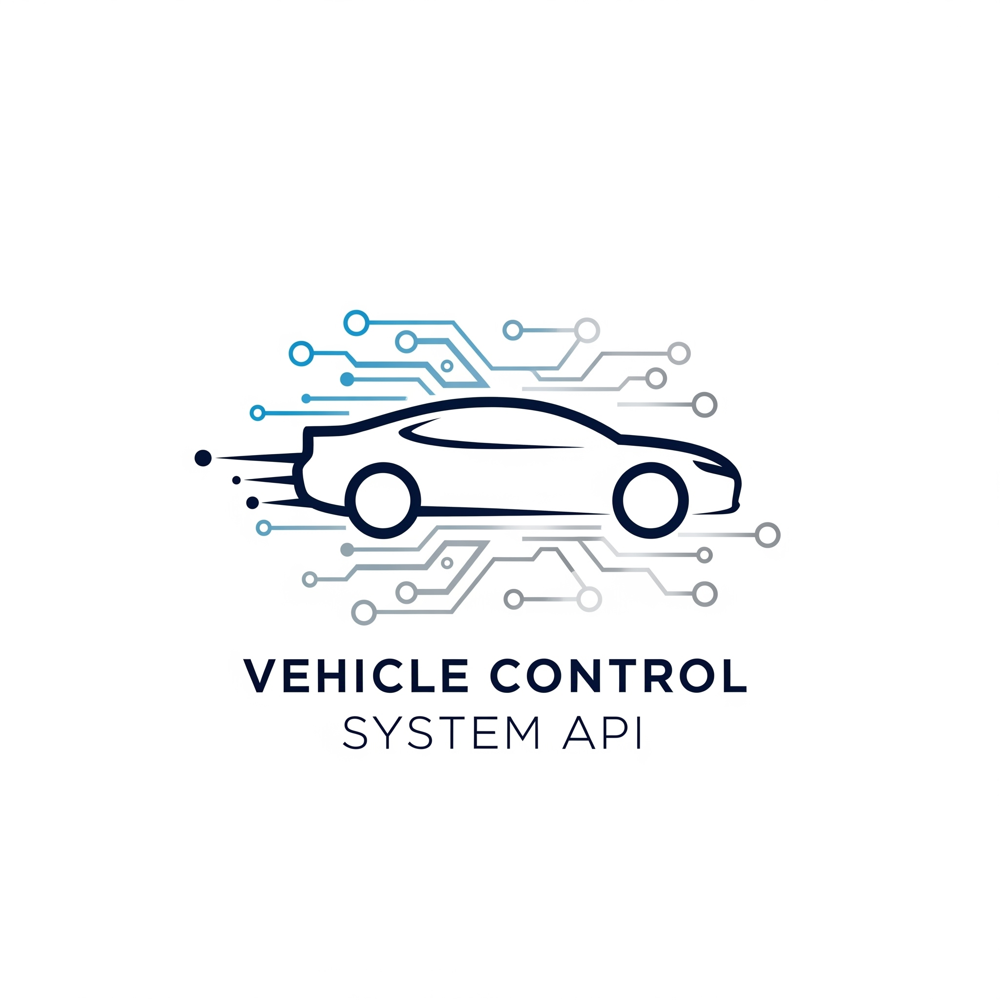

<!-- LOGO -->
<!--
A logo é exibida via HTML para centralização e controle de tamanho.
O alt text é descritivo para acessibilidade.
-->
<p align="center">
  
</p>

<!-- BADGES -->
<p align="center">
  <a href="https://nodejs.org/en" target="_blank">
    
  </a>
  <a href="https://www.npmjs.com/" target="_blank">
    =9.x-red?style=for-the-badge&logo=npm" alt="NPM">
  </a>
  <a href="https://www.docker.com/" target="_blank">
    
  </a>
  <a href="https://seidor-rh.onrender.com" target="_blank">
    
  </a>
  <a href="./openapi.yaml" target="_blank">
    
  </a>
  <a href="./LICENSE" target="_blank">
    
  </a>
  <a href="https://github.com/devferreirag/Saidor/commits/main" target="_blank">
    
  </a>
  <a href="https://github.com/devferreirag/Saidor/issues" target="_blank">
    
  </a>
  <a href="https://github.com/devferreirag/Saidor/pulls" target="_blank">
    
  </a>
  <a href="https://github.com/devferreirag/Saidor/graphs/contributors" target="_blank">
    
  </a>
</p>

---

# Vehicle Control System API

API RESTful para gestão de frotas, motoristas e utilizações. Arquitetura escalável, testes automatizados, documentação OpenAPI e pronta para produção. Foco em facilidade de manutenção, evolução e integração real.

<p align="center">
  <a href="https://seidor-rh.onrender.com" target="_blank" style="font-size:1.2em;"><b>🌐 Teste a demonstração online</b></a>
</p>

---

## 📑 Sumário

- [Visão Geral](#visão-geral)
- [Diferenciais](#diferenciais)
- [Demonstração Online](#demonstração-online)
- [Funcionalidades](#funcionalidades)
- [Arquitetura & Tecnologias](#arquitetura--tecnologias)
- [Instalação](#instalação)
- [Testes & Cobertura](#testes--cobertura)
- [Documentação](#documentação)
- [Exemplos de Uso](#exemplos-de-uso)
- [Contribuição](#contribuição)
- [Roadmap](#roadmap)
- [Licença](#licença)
- [Contato](#contato)

---

## 🚗 Visão Geral

O **Vehicle Control System API** é uma solução robusta para gestão de frotas, motoristas e utilizações, desenvolvida com Clean Code, SOLID, testes automatizados e documentação profissional.

---

## ✨ Diferenciais

- **Produto real:** Endpoints prontos para cenários de gestão de frotas.
- **Qualidade:** Testes, documentação, deploy automatizado.
- **Onboarding rápido:** Código limpo, exemplos claros.
- **Futuro-proof:** Pronto para integrações, autenticação e webhooks.

---

## 🚀 Demonstração Online

- **Render:** [https://seidor-rh.onrender.com](https://seidor-rh.onrender.com)
- **Swagger UI:** [https://seidor-rh.onrender.com/api-docs](https://seidor-rh.onrender.com/api-docs)

---

## 🛠️ Funcionalidades

| Feature                       | Descrição                                                  |
|-------------------------------|------------------------------------------------------------|
| CRUD Automóveis               | Cadastro, listagem, busca, edição e remoção de automóveis.  |
| CRUD Motoristas               | Cadastro, listagem, busca, edição e remoção de motoristas.  |
| Utilização de Automóveis      | Início/fim de uso, histórico, paginação, regras de negócio. |
| Health Check                  | Endpoint `/health` para monitoramento.                      |
| Rate Limiting                 | Proteção contra abuso de requisições.                       |
| Validação de Dados            | Validação robusta via express-validator.                    |
| Documentação OpenAPI/Swagger  | Especificação completa e playground interativo.             |
| Testes Unitários e Integração | Cobertura total com Jest e Supertest.                       |
| Deploy Docker e Render        | Pronto para produção e cloud.                               |
| Clean Code & SOLID            | Código limpo, modular, fácil de manter.                     |

---

## 🏗️ Arquitetura & Tecnologias

- **Node.js 18+**
- **Express.js**
- **Jest & Supertest** (testes)
- **Docker** (containerização)
- **Render** (deploy cloud)
- **OpenAPI 3.0** (documentação)
- **Express-validator** (validação)
- **Clean Code, SOLID, Modular**

### Estrutura de Pastas

```
controle/
├── src/
│   ├── api/
│   │   ├── automoveis/
│   │   ├── health/
│   │   ├── motoristas/
│   │   └── utilizacoes/
│   ├── middlewares/
│   ├── utils/
│   ├── app.js
│   └── server.js
├── tests/
│   ├── unit/
│   └── integration/
├── openapi.yaml
├── render.yaml
├── Dockerfile
├── package.json, .env, etc.
```

---

## ⚡ Instalação

### Pré-requisitos

- Node.js >= 18.x
- NPM >= 9.x
- Docker (opcional)

### Instalação Local

```bash
git clone https://github.com/FuturoDevJunior/SEIDOR_RH.git
cd SEIDOR_RH
npm install
cp .env.example .env # Ajuste as variáveis se necessário
```

### Execução

- **Desenvolvimento:**  
  `npm run dev`
- **Produção:**  
  `npm start`

### Docker

```bash
docker build -t controle-automoveis-api .
docker run -p 3000:3000 -e PORT=3000 controle-automoveis-api
```

### Testes

Após instalar as dependências, execute:

```bash
npm test
```

---

## 🧪 Testes & Cobertura

- **Testes unitários e integração:**  
  `npm test`
- **Cobertura de testes:**  
  `npm run coverage` (relatório local em `coverage/lcov-report/index.html`).
- **Frameworks:** Jest, Supertest.

---

## 📖 Documentação

- **Swagger UI:**  
  [https://seidor-rh.onrender.com/api-docs](https://seidor-rh.onrender.com/api-docs)
- **Arquivo OpenAPI:**  
  [`openapi.yaml`](./openapi.yaml)

### Endpoints Principais

- `GET /health` — Health check.
- `POST /api/automoveis` — Criar automóvel.
- `GET /api/automoveis` — Listar automóveis.
- `GET /api/automoveis/:id` — Buscar automóvel.
- `PUT /api/automoveis/:id` — Atualizar automóvel.
- `DELETE /api/automoveis/:id` — Remover automóvel.
- `POST /api/motoristas` — Criar motorista.
- `GET /api/motoristas` — Listar motoristas.
- `GET /api/motoristas/:id` — Buscar motorista.
- `PUT /api/motoristas/:id` — Atualizar motorista.
- `DELETE /api/motoristas/:id` — Remover motorista.
- `POST /api/utilizacoes` — Iniciar utilização.
- `PATCH /api/utilizacoes/:id/finalizar` — Finalizar utilização.
- `GET /api/utilizacoes` — Listar utilizações (paginação).

---

## 📦 Exemplos de Uso

### Criar Automóvel

```bash
curl -X POST https://seidor-rh.onrender.com/api/automoveis \
  -H 'Content-Type: application/json' \
  -d '{"placa": "ABC-1234", "cor": "Azul", "marca": "MarcaXYZ"}'
```

**Resposta:**
```json
{
  "id": "gerado-pelo-uuid",
  "placa": "ABC-1234",
  "cor": "Azul",
  "marca": "MarcaXYZ"
}
```

### Listar Utilizações (com paginação)

```bash
curl "https://seidor-rh.onrender.com/api/utilizacoes?page=1&limit=10"
```

**Resposta:**
```json
{
  "items": [
    {
      "id": "uuid-da-utilizacao",
      "motoristaId": "uuid-do-motorista",
      "automovelId": "uuid-do-automovel",
      "dataInicio": "2024-07-31T12:00:00.000Z",
      "dataFim": null,
      "motivoUtilizacao": "Viagem a serviço",
      "motorista": { "id": "uuid-do-motorista", "nome": "Nome do Motorista" },
      "automovel": { "id": "uuid-do-automovel", "placa": "ABC-1234", "marca": "Marca", "cor": "Cor" }
    }
  ],
  "totalItems": 1,
  "totalPages": 1,
  "currentPage": 1,
  "itemsPerPage": 10
}
```

---

## 🤝 Contribuição

Sinta-se à vontade para contribuir!  
Siga os passos:

1. Fork este repositório.
2. Crie uma branch: `git checkout -b feature/NovaFeature`.
3. Commit suas alterações: `git commit -m 'feat: Nova feature'`.
4. Push para sua branch: `git push origin feature/NovaFeature`.
5. Abra um Pull Request.

Sugestões, dúvidas ou bugs? [Abra uma issue](https://github.com/FuturoDevJunior/SEIDOR_RH/issues)!

Consulte o [CONTRIBUTING.md](./CONTRIBUTING.md) para mais detalhes.

---

## 🗺️ Roadmap

- [x] CRUD Automóveis
- [x] CRUD Motoristas
- [x] Utilização de Automóveis
- [x] Health Check
- [x] Rate Limiting
- [x] Documentação OpenAPI/Swagger
- [x] Testes unitários e integração
- [x] Deploy Docker e Render
- [ ] Autenticação JWT (futuro)
- [ ] Integração com banco de dados persistente (futuro)
- [ ] Webhooks e eventos (futuro)

---

## 📄 Licença

Distribuído sob a licença ISC.  
Veja o campo "license" do [`package.json`](./package.json) para mais informações.

---

## 👤 Contato

Desenvolvido por [Gabriel Ferreira](https://linkedin.com/in/devferreirag).  
Agradecimentos especiais a todos os contribuidores, à comunidade Node.js e aos mantenedores de ferramentas open source!

<p align="center">
  <em>Este projeto é resultado de paixão por tecnologia, atenção a detalhes e compromisso com excelência. Se você busca alguém com visão de produto, foco em qualidade e espírito colaborativo, vamos conversar!</em>
  <br>
  <em>Powered by DevFerreiraG</em>
</p>
